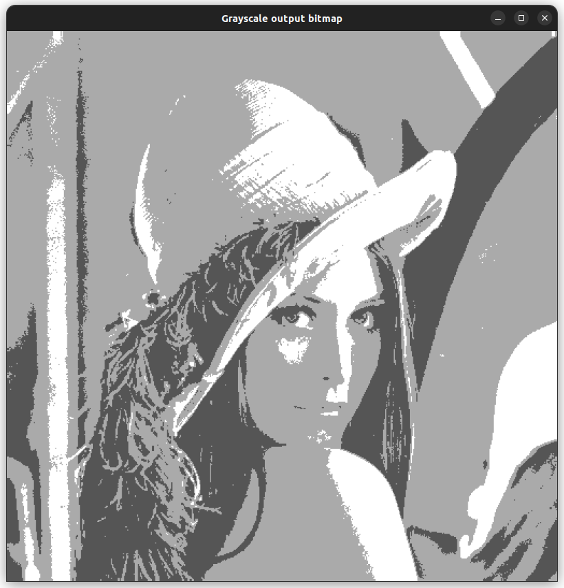

# pics2bits - from images to bitmaps in C++

pics2bits is a C++ library to create bitmaps corresponding to images, reducing the needed memory to represent information in applications that do require that type of attention to detail and do not need the whole 256 possible values of a grayscale pixel.

It does not aim to be an efficiency-focused library, unless the application that uses it can benefit from such an implementation, like the one that inspired it.
pics2bits extensively uses the OpenCV library and has builtin integrations for it.

A demo binary is included to show relevant performance metrics and can be compiled with cmake (or via the provided [cmake.sh](./cmake.sh)):

```sh
mkdir -p build &&
cmake -DCMAKE_BUILD_TYPE=Release build/ &&
cmake --build ./build --target all
```

An OpenCV install script is also included [here](./OpenCV_installer.sh) if needed:

```sh
sudo apt update &&
sudo apt install git cmake make g++-12 &&
git clone https://github.com/opencv/opencv.git &&
cd opencv && mkdir -p build && cd build &&
cmake -DWITH_QT=ON -DWITH_OPENGL=ON .. &&
make -j4 &&
sudo make install
```

## Screenshots

|  |
|:--:|
| _Lena bitmap grayscale representation with a pixel size of 2 bits_ |

|  |
|:--:|
| _Representation of a bitmap resulting from the add of many images (black represents the absence of information)_ |

|  |
|:--:|
| _Metrics of a 5376x3584 image converted to a bitmap with a pixel size of 1 bit_ |

|  |
|:--:|
| _Metrics of a 5376x3584 image converted to a bitmap with a pixel size of 2 bits_ |

|  |
|:--:|
| _Metrics of a 5376x3584 image converted to a bitmap with a pixel size of 4 bits_ |
